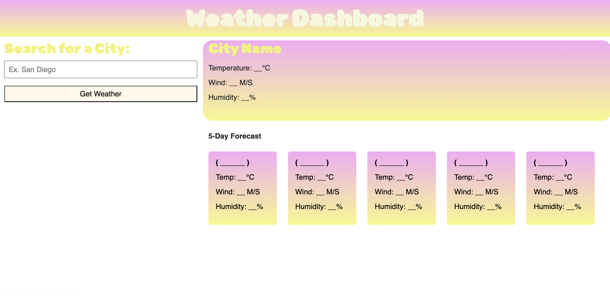

# weather-website

https://cassidykovell.github.io/weather-website/

## Description

This webpage shows you information about the weather for the current day and the five following days.

## Installation
No notes for installation.

## Usage
In order to use this website the user must type in a city and click 'Get Weather'. They will be presented with the weather conditions such as, tempurature, wind speed, and humidity, for the current day as well as the following five days. The current day and following five days will also be denoted by their date. When the user searches up a city the city is stored and desplayed below the input box so that if they click on it again they will get the weather conditions for that city

## Credits
Help from my TA in office hours, a tutor, and the Xpert Learning Assistant.

## License

## Badges

## Features
The features for this webpage include displaying weather conditions, saving user data, and the ability to use that saved data to redisplay weather conditions.

## How to Contribute

## Tests